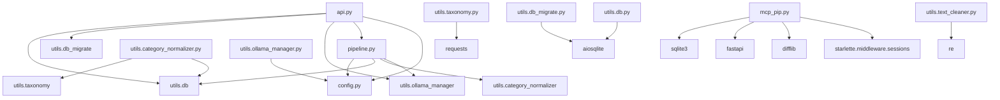

# Code Map

## File Dependencies (Mermaid Graph)

## File Details

### `pipeline.py`

**Functions Defined:**
*   `__init__` (method of `MultiModelSEOManager`)
*   `get_best_model_for_task` (method of `MultiModelSEOManager`)
*   `_check_model_availability` (method of `MultiModelSEOManager`)
*   `optimize_meta_tags` (method of `MultiModelSEOManager`)
*   `rewrite_content` (method of `MultiModelSEOManager`)
*   `analyze_keywords` (method of `MultiModelSEOManager`)
*   `_call_model_with_fallback` (method of `MultiModelSEOManager`)
*   `_call_ollama_model` (method of `MultiModelSEOManager`)
*   `_parse_model_response` (method of `MultiModelSEOManager`)
*   `_validate_response` (method of `MultiModelSEOManager`)
*   `_rule_based_fallback` (method of `MultiModelSEOManager`)
*   `_clean_html` (method of `MultiModelSEOManager`)
*   `_normalize_categories_for_products` (method of `MultiModelSEOManager`)
*   `batch_process_products` (method of `MultiModelSEOManager`)
*   `main`

**Imports:**
*   `json`
*   `re`
*   `time`
*   `logging`
*   `typing` (Dict, List, Any, Optional)
*   `enum` (Enum)
*   `requests`
*   `bs4` (BeautifulSoup)
*   `config` (settings, TaskType)
*   `aiosqlite`
*   `utils.db` (log_change, update_product_details)
*   `utils.category_normalizer` (normalize_categories)
*   `argparse`
*   `asyncio`

**Function Calls (simplified):**
*   `logging.basicConfig`
*   `logging.getLogger`
*   `settings.paths.database`
*   `settings.ollama.base_url`
*   `settings.model_capabilities.capabilities`
*   `settings.model_capabilities.fallback_order`
*   `self._check_model_availability`
*   `requests.get`
*   `response.json`
*   `tags_data.get`
*   `requests.post`
*   `self.get_best_model_for_task`
*   `product_data.get`
*   `self._clean_html`
*   `self._call_model_with_fallback`
*   `self._call_ollama_model`
*   `self._validate_response`
*   `logger.info`
*   `logger.warning`
*   `self._rule_based_fallback`
*   `capabilities_obj.model_dump`
*   `capabilities.get`
*   `response.json`
*   `self._parse_model_response`
*   `re.search`
*   `json.loads`
*   `required_fields.get`
*   `BeautifulSoup`
*   `soup.get_text`
*   `normalize_categories`
*   `aiosqlite.connect`
*   `conn.cursor`
*   `cursor.execute`
*   `cursor.fetchone`
*   `update_product_details`
*   `log_change`
*   `logger.error`
*   `argparse.ArgumentParser`
*   `parser.add_argument`
*   `parser.parse_args`
*   `MultiModelSEOManager`
*   `manager.db_path`
*   `manager.batch_process_products`
*   `asyncio.run`

### `utils/category_normalizer.py`

**Functions Defined:**
*   `normalize_categories`

**Imports:**
*   `aiosqlite`
*   `logging`
*   `utils.taxonomy` (load_taxonomy, find_best_category)
*   `utils.db` (update_product_details)

**Function Calls:**
*   `logging.getLogger`
*   `load_taxonomy`
*   `aiosqlite.connect`
*   `conn.row_factory`
*   `conn.cursor`
*   `cursor.execute`
*   `cursor.fetchall`
*   `logger.info`
*   `find_best_category`
*   `update_product_details`

### `utils/ollama_client.py`

**Functions Defined:**
*   `__init__` (method of `OllamaClient`)
*   `get_response` (method of `OllamaClient`)

**Imports:**
*   `ollama`

**Function Calls:**
*   `ollama.Client`
*   `self.client.generate`
*   `print`

### `config.py`

**Functions Defined:**
*   `convert_tasks_to_enum` (classmethod of `ModelConfig`)
*   `base_url` (property of `Ollama`)
*   `api_url` (property of `Ollama`)
*   `settings_customise_sources` (classmethod of `Settings`)

**Classes Defined:**
*   `TaskType` (Enum)
*   `ModelConfig` (BaseModel)
*   `ModelCapabilities` (BaseModel)
*   `Ollama` (BaseModel)
*   `Models` (BaseModel)
*   `Paths` (BaseModel)
*   `Categories` (BaseModel)
*   `Fields` (BaseModel)
*   `Pipeline` (BaseModel)
*   `Settings` (BaseSettings)

**Imports:**
*   `pydantic_settings` (BaseSettings, SettingsConfigDict, YamlConfigSettingsSource)
*   `pydantic` (BaseModel, field_validator)
*   `typing` (ClassVar, List, Dict, Any)
*   `enum` (Enum)
*   `os`

**Function Calls:**
*   `os.getenv`
*   `SettingsConfigDict`
*   `YamlConfigSettingsSource`
*   `Settings` (instantiation)

### `utils/db_migrate.py`

**Functions Defined:**
*   `migrate_schema`

**Imports:**
*   `aiosqlite`

**Function Calls:**
*   `aiosqlite.connect`
*   `conn.cursor`
*   `cur.execute`
*   `cur.fetchall`
*   `print`
*   `conn.commit`

### `utils/taxonomy.py`

**Functions Defined:**
*   `load_taxonomy`
*   `find_best_category`

**Imports:**
*   `os`
*   `requests`
*   `difflib`
*   `json`

**Function Calls:**
*   `os.path.exists`
*   `json.load`
*   `print`
*   `requests.get`
*   `r.raise_for_status`
*   `r.text.splitlines`
*   `os.makedirs`
*   `os.path.dirname`
*   `json.dump`
*   `difflib.get_close_matches`
*   `difflib.SequenceMatcher`
*   `round`

### `utils/ollama_manager.py`

**Functions Defined:**
*   `list_ollama_models`
*   `pull_ollama_model`

**Imports:**
*   `requests`
*   `typing` (List, Dict, Any)
*   `config` (settings)

**Function Calls:**
*   `settings.ollama.base_url`
*   `requests.get`
*   `response.raise_for_status`
*   `response.json`
*   `print`
*   `requests.post`

### `api.py`

**Functions Defined:**
*   `lifespan`
*   `health_check`
*   `get_products`
*   `get_product`
*   `update_product`
*   `get_review_products`
*   `review_product`
*   `get_changes`
*   `get_ollama_models`
*   `pull_model`
*   `run_pipeline`
*   `get_db_schema_endpoint`
*   `run_migrations`
*   `serve_frontend`

**Classes Defined:**
*   `ProductUpdate` (BaseModel)
*   `ModelPullRequest` (BaseModel)
*   `PipelineRunRequest` (BaseModel)

**Imports:**
*   `fastapi` (FastAPI, Request, HTTPException)
*   `fastapi.staticfiles` (StaticFiles)
*   `fastapi.responses` (FileResponse, JSONResponse)
*   `pydantic` (BaseModel)
*   `typing` (List, Optional)
*   `contextlib` (asynccontextmanager)
*   `logging`
*   `os`
*   `sys`
*   `pathlib` (Path)
*   `utils.db` (get_all_products, get_product_details, update_product_details, get_products_for_review, mark_as_reviewed, get_change_log, update_database_schema, get_db_schema)
*   `utils.db_migrate` (migrate_schema)
*   `utils.ollama_manager` (list_ollama_models, pull_ollama_model)
*   `pipeline` (MultiModelSEOManager)
*   `config` (settings, TaskType)
*   `asyncio`
*   `aiohttp`
*   `aiosqlite`

**Function Calls:**
*   `sys.path.append`
*   `Path(__file__).parent.parent`
*   `logging.info`
*   `update_database_schema`
*   `settings.paths.database`
*   `get_all_products`
*   `logging.error`
*   `FastAPI` (instantiation)
*   `app.mount`
*   `StaticFiles`
*   `app.get`
*   `app.put`
*   `app.post`
*   `ProductUpdate.model_dump`
*   `get_product_details`
*   `HTTPException`
*   `get_products_for_review`
*   `mark_as_reviewed`
*   `get_change_log`
*   `list_ollama_models`
*   `pull_ollama_model`
*   `MultiModelSEOManager` (instantiation)
*   `manager.batch_process_products`
*   `get_db_schema`
*   `migrate_schema`
*   `FileResponse`

### `utils/db.py`

**Functions Defined:**
*   `get_products_batch`
*   `get_products_for_review`
*   `get_all_products`
*   `get_product_details`
*   `update_product_details`
*   `get_change_log`
*   `get_db_schema`
*   `mark_as_reviewed`
*   `log_change`
*   `update_database_schema`

**Imports:**
*   `aiosqlite`
*   `datetime`
*   `json`
*   `logging`

**Function Calls:**
*   `logging.basicConfig`
*   `aiosqlite.connect`
*   `conn.row_factory`
*   `conn.cursor`
*   `cur.execute`
*   `cur.fetchall`
*   `logging.error`
*   `cur.fetchone`
*   `conn.commit`
*   `json.dumps`
*   `datetime.datetime.now`
*   `isoformat`

### `mcp_pip.py`

**Functions Defined:**
*   `get_conn`
*   `home`
*   `diff_view`
*   `approve`
*   `reject`

**Classes Defined:**
*   `FastAPI` (instantiation)
*   `Jinja2Templates` (instantiation)

**Imports:**
*   `sqlite3`
*   `fastapi` (FastAPI, Request, HTTPException)
*   `fastapi.responses` (HTMLResponse, RedirectResponse)
*   `fastapi.templating` (Jinja2Templates)
*   `difflib` (HtmlDiff)
*   `starlette.middleware.sessions` (SessionMiddleware)

**Function Calls:**
*   `FastAPI`
*   `app.add_middleware`
*   `SessionMiddleware`
*   `Jinja2Templates`
*   `get_conn`
*   `conn.cursor`
*   `cur.execute`
*   `cur.fetchall`
*   `conn.close`
*   `templates.TemplateResponse`
*   `HtmlDiff`
*   `make_table`
*   `HTTPException`
*   `RedirectResponse`

### `utils/text_cleaner.py`

**Functions Defined:**
*   `clean_html`
*   `shorten`

**Imports:**
*   `re`

**Function Calls:**
*   `re.sub`
*   `text.strip`
